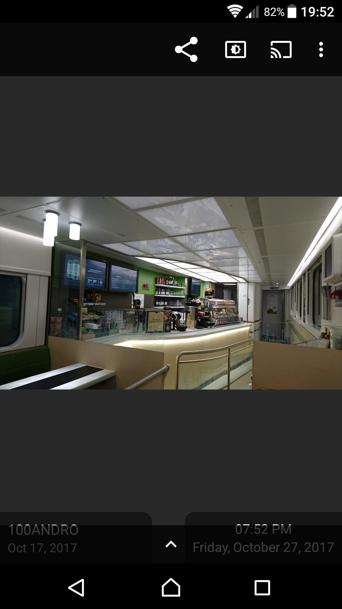
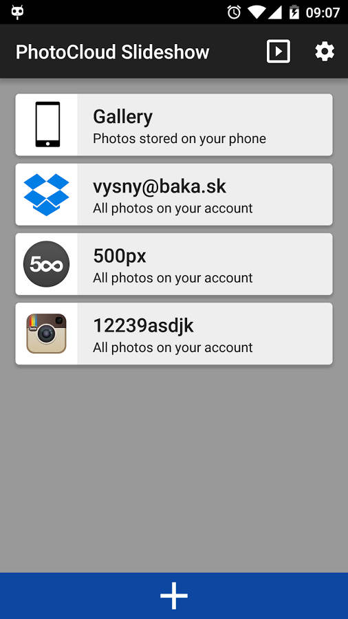

photocloud-frame-slideshow
# PhotoCloud Frame Slideshow

Just sit back and watch your photos with your family; convert your old Android tablet to a digital photo frame; browse your cloud photos, hassle-free. The only digital frame application which supports your own OwnCloud/NextCloud servers, with self-signed https certificates.

Supported photo streams:
- Files stored on any OwnCloud/NextCloud server, even with self-signed https certificate
- Files stored in your Dropbox account
- Local Gallery
- Flickr
- Microsoft OneDrive
- Windows Shares (Samba)
- Mega
- 500px
- Instagram (Instagram removed the Feed API thus only the Recent Media is accessible)
- SSH and SFTP
- DLNA/UPNP

Supported image types:
- bitmap: png, gif, bmp, jpg, jpeg
- raw: crw, cr2, nef, raf, dng, mos, kdc, dcr (by default ignored since loading RAWs will generate huge network traffic; just enable raws in app's Settings)

Please download the PhotoCloud application at [Google Play](https://play.google.com/store/apps/details?id=sk.baka.photoframe).

Endlessly cycles photos from any combination of the streams. You can play all photos from the stream, or you can limit the stream to given list of directories (and subdirs). You can also browse the files of the stream manually. The photos are automatically cached locally; when offline, you can show slideshow from cached photos only.
Supports slideshowing photos from subdirectories.

Supports ChromeCast (requires Android 4.4 and higher) - casts current slideshow to your TV. Leanback/Android TV is not currently supported.

Pricing: free version shows a "please purchase" images once a while during the slideshow. There is a single in-app payment which removes these images.
Another payment unlocks the "Daydream" functionality; this only works on Android 4.2 and higher.

Please note:
This is just a digital frame / photo browser. It does not play any music, does not create videos, does not replace your gallery app, it does simply one thing - shows a slideshow of your photos - and does it simply and right.

Because of its nature, the application generates a very high network traffic - please make sure you have WIFI enabled. The app has built-in network protection and will abort the Slideshow if WIFI disconnects.

No annoying video commercials, simple to use. This application is at its infancy, please let me know which features would you like me to implement. The following features are planned:

1. Each directory will be able to be configured with a daily hour range at which the directory is polled for photos - you can create a daily gallery, an evening gallery, even a night gallery.
2. Add support for Google Picasa, Facebook, Google plus, ...

# Privacy Policy

PhotoCloud Frame Slideshow remembers your username/password only for certain services which do not support security tokens (for example Samba and OwnCloud). PhotoCloud never sends your data anywhere else but the stream server itself, solely for the purpose of authenticating and downloading images. Images are downloaded to your phone only, they are never uploaded anywhere. The images are cached for quicker display, you can delete the caches at any time.

PhotoCloud uploads warning and error messages anonymously to Crashlytic, for the sole purpose of helping bug fixing. Those error messages never contain any username nor password. Other than that, PhotoCloud uploads nothing nowhere else, except for the sole purpose of downloading images (you have to let the server know that you wish to download given image) :-D

# Links

* Discussions forums: https://groups.google.com/forum/#!forum/photocloud-frame
* Bugs, issues, feature requests: https://github.com/mvysny/photocloud-frame-slideshow/issues
* Contact author at: photocloud-frame@googlegroups.com

# FAQ (Frequently Asked Questions)

### ChromeCast icon not shown

When you start the slideshow, just touch the image, to pause the slideshow and to reveal more controls:

The upper bar shows the following action buttons:

* The *Share button* which allows you to share the image to other apps
* The *Keep Screen* On button which leaves the screen on, or allows the screen to go off during the slideshow
* The *Set As Wallpaper* button which sets current photo as a background
* Finally, the *Chromecast* button which casts the slideshow to your chromecast device as well. Note that
  the Chromecast button is only visible when your phone actually sees the Chromecast device (the Chromecast device is on
  and the phone is connected to the same wifi as the Chromecast device itself). **Note**: the Chromecast connectivity
  and the Chromecast button visibility is completely in control of Google's code - the PhotoCloud app can not show/hide the button
  itself. If the button is hidden even though Chromecast is on, then there is nothing I can do.
  Please report a bug to Google guys.

The lower bar with the up-arrow will reveal the detailed EXIF data upon touch.

### Slideshow from a subfolder

There are two ways to achieve this:

* One-time: just touch the Stream card, to reveal the *Browse* button; then use the Browser to locate the directory.
  Long-touch the directory and select the *Slideshow* option. That will start slideshow from that folder only.
  
* By default, choosing the *Slideshow* from the Stream card menu will slideshow all photos in that Stream.
  To limit the slideshow to only particular subfolder, *Browse* the Stream and locate the directory.
  Then, long-touch the directory and select the *Root Stream Here* option. From now on, this Stream slideshows
  will only show this folder. You can add additional folders; slideshow will then show photos from all of these folders.
  The folders will be listed in the Stream Card; just press the blue trash bin icon to remove those folders.

### Slideshow from multiple Streams

Just touch the Stream icon, located to the left corner of the Stream card.

The main screen listing four stream cards:

You will be able to check multiple streams; then just touch the upper-right *Start Slideshow* button
to start slideshow from all of those streams.

### Adding more Streams

Open the main screen and touch the lower big white plus button. You will be able to add additional streams.

### Settings

Touch the upper-right cog wheel *Settings* button in the main screen. You can for example configure to
start slideshow from a Stream (or a combination of Streams)

* When your device boots;
* When your power cable is plugged in;

And others.
 