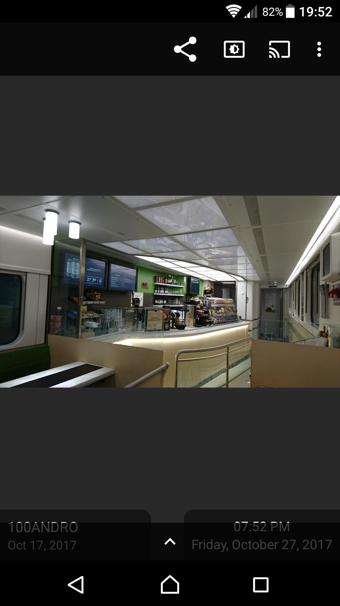
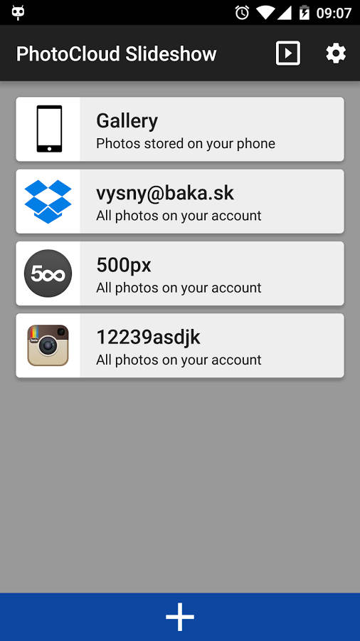

# FAQ (Frequently Asked Questions)

## ChromeCast icon not shown

When you start the slideshow, just touch the image, to pause the slideshow and to reveal more controls:

<a href="images/chromecast.jpg"></a>

The upper bar shows the following action buttons:

* The *Share button* which allows you to share the image to other apps
* The *Keep Screen* On button which leaves the screen on, or allows the screen to go off during the slideshow
* The *Set As Wallpaper* button which sets current photo as a background
* Finally, the *Chromecast* button which casts the slideshow to your chromecast device as well. Note that
  the Chromecast button is only visible when your phone actually sees the Chromecast device (the Chromecast device is on
  and the phone is connected to the same wifi as the Chromecast device itself). **Note**: the Chromecast connectivity
  and the Chromecast button visibility is completely in control of Google's code - the PhotoCloud app can not show/hide the button
  itself. If the button is hidden even though Chromecast is on, then there is nothing I can do.
  Please report a bug to Google guys.

The lower bar with the up-arrow will reveal the detailed EXIF data upon touch.

## Purchase not restored after reinstall

The purchase is tied to your Google Play account. Therefore, you can factory-wipe your phone and reinstall it
from scratch - as long as it's tied to your Google Play account the PhotoCloud should remain activated.

There are two separate one-time purchases possible for this app:

* The "Remove Nagging Screen" purchase which removes the "please purchase" nagging screen;
* The "Daydream" support purchase which allows Photocloud to be registered as a Daydream service on your phone.

The app should be automatically activated on all of your devices connected to the same Google account.
You definitely do not need to purchase the app separately per device; a single purchase from one device should unlock the app on all devices connected to that Google account.

Troubleshooting:

* The nagging screen is still shown even though I've made the purchase. Please make sure that you've purchased the "Remove Nagging Screen" purchase -
  purchasing the "Daydream" support won't make the nagging screen go away.
* If the nagging screen still shows, maybe the purchase hasn't been registered
  in PhotoCloud correctly - please try to reboot your phone.
* To verify the purchase, launch PhotoCloud and go into the `Settings / About` and scroll
  the About screen to the bottom:
  * The "In-App Purchases API available" should be set to
    "true" (if not, then Google Play is not available on your device)
  * "Unlocked Nagging Dialog" should be set to "true". If not, then Google
    Play is errorneously informing PhotoCloud that the purchase
    hasn't been completed. In this case the problem is in Google Play and/or Google internal systems,
    and you need to contact the Google guys to verify that the purchase went through.
    They take 30% off of PhotoCloud price, and thus they are paid to solve such issues -
    just go there and complain.
* If the "Unlocked Nagging Dialog" is "true" then PhotoCloud knows you've done the
  purchase and it is a bug if PhotoCloud still shows the nagging screen. In that case, please open
  a bug report in the [PhotoCloud Bug Tracker](https://github.com/mvysny/photocloud-frame-slideshow/issues).
* If the "Unlocked Nagging Dialog" is "false", please make sure that your user is still logged in into Google Play.
  For example, someone else could have logged in into your TV. Also, please make sure that
  the purchase shows in your Google Play's "Payments & subscriptions -> Budget & history" page.

## Getting Billing Error #5

This error:

> Billing error #5 Developer Error: Invalid argument provided to the API.
> This error can also indicate that the application was not correctly signed or properly setup for In-app Billing.
> in Google Play or does not have the necessary permissions in its manifest:
> java.lang.Throwable:Client is already in the process of connecting to billing service.

Currently there is no known solution, apart from making sure that you have the newest Google Play
installed on your phone.

## Slideshow from a subfolder

There are two ways to achieve this:

* One-time: just touch the Stream card, to reveal the *Browse* button; then use the Browser to locate the directory.
  Long-touch the directory and select the *Slideshow* option. That will start slideshow from that folder only.
* By default, choosing the *Slideshow* from the Stream card menu will slideshow all photos in that Stream.
  To limit the slideshow to only particular subfolder, *Browse* the Stream and locate the directory.
  Then, long-touch the directory and select the *Root Stream Here* option. From now on, this Stream slideshows
  will only show this folder. You can add additional folders; slideshow will then show photos from all of these folders.
  The folders will be listed in the Stream Card; just press the blue trash bin icon to remove those folders.

## Slideshow from multiple Streams

Just touch the Stream icon, located to the left corner of the Stream card.

The main screen listing four stream cards:

<a href="images/stream_cards.jpg"></a>

You will be able to check multiple streams; then just touch the upper-right *Start Slideshow* button
to start slideshow from all of those streams.

## Google Photos NOT SUPPORTED

[Google Photos](https://photos.google.com/) ARE NO LONGER SUPPORTED.
Read [bug #134](https://github.com/mvysny/photocloud-frame-slideshow/issues/134) for more details.

## Google Drive

PhotoCloud only sees images explicitly shared with PhotoCloud in Google Drive - it
does not see all images nor all files in your Google Drive account.
This is the new Google security policy and there's nothing I can do about it. Please share your images
with PhotoCloud in your Google Drive. TODO how to do that?

## Adding more Streams

Open the main screen and touch the lower big white plus button. You will be able to add additional streams.

## Settings

Touch the upper-right cog wheel *Settings* button in the main screen. You can for example configure to
start slideshow from a Stream (or a combination of Streams)

* When your device boots;
* When your power cable is plugged in;

And others.

### Removing All Widgets From The Slideshow

To remove all widgets, please make sure all of the following settings are off:

* Settings / Widgets/HUD / Show Clock
* Settings / Widgets/HUD / Show Weather Forecast
* Settings / Widgets/HUD / Show EXIF in Slideshow
* Settings / Widgets/HUD / Show photo file name

See [Issue 119](https://github.com/mvysny/photocloud-frame-slideshow/issues/119) for more details.

### Photo Cache Explained

When launching a slideshow, a photo is downloaded from the server only if there's
no cached version or if the cached version is too old.
If the photo exists on the server, it is cached and displayed. If the photo no longer exists on the server,
it is removed from the cache.

So, the cache is updated/cleared only gradually, as the slideshow is running.

The definition of "too old" depends on the *Short-Lived Cache* setting:
* `Off` = a photo is old if it has been downloaded from the server 30 days ago or earlier.
* `On` = a photo is old if it has been downloaded from the server 1 day ago (yesterday) or earlier.

## Launching PhotoCloud at boot-up time

When configured, PhotoCloud is able start when your device boots up, turning your device into a photo frame.
However this tends to be tricky, therefore please make sure to revisit all of the following
items:

1. In Settings / Slideshow, make sure that the "Auto-start Slideshow on Boot" is checked. Sometimes the Wifi may settle slowly, in that case please just check
also the "Delay auto-start Slideshow on Boot" setting.
2. You need to start the PhotoFrame app *at least once* by *touching* the PhotoCloud *launcher icon*, otherwise Android will not send the `RECEIVE_BOOT_COMPLETED` to the app
and the app will not start. This is a built-in Android security measurement and there's nothing PhotoCloud can do.
3. Please make sure that the `RECEIVE_BOOT_COMPLETED` permission is enabled for PhotoCloud and that your phone haven't accidentally removed that permission.
Typically you open the list of installed apps, find PhotoCloud and you can find the permissions there. However, this may differ on certain phones; please follow your phone's permission manager
tutorial to review the permissions.

NOTE: Unfortunately for some phones/Android versions PhotoCloud won't start on boot-up. Please see [Issue #176](https://github.com/mvysny/photocloud-frame-slideshow/issues/176)
for more details.

## Launching PhotoCloud from Tasker

You can use the Tasker app to run PhotoCloud in any way you need. Simply configure Tasker
to send the `sk.baka.photoframe.START_SLIDESHOW` intent action. Please see [Issue #46](https://github.com/mvysny/photocloud-frame-slideshow/issues/46)
for detailed steps.

## Memory & Crashes

Most often PhotoCloud crashes because Android doesn't give PhotoCloud enough memory to hold the images in. You can verify this, by going into `Settings` / `About`
and scrolling to the System Stats. On my phone, Android says that it gives PhotoCloud 512 MB of memory, however on low-cost/older phones this number might be
dramatically lower.

For a FullHD screen, the photo is shrank to 1920x1080 and since we have RGBA model which takes 4 bytes per every pixel, such a photo requires 1920x1080x4 = 8294400 bytes = whopping 8MB
of memory (RAWs take even more space since they don't support automatic shrink on load and are loaded as-they-are into memory, then resized).
PhotoCloud may at any time require to have 4 images loaded in memory: 

- one being shown currently,
- one being loaded from the stream in the background,
- two more images loaded as "previous" when you pause the slideshow

Therefore, PhotoCloud requires at least 32MB of memory only for images, plus the app itself uses a bit of memory for views and bookkeeping. Therefore, PhotoCloud requires
*at least as a bare minimum* 48MB of memory on 1080P/FullHD device; not to mention that the garbage collector is pretty shitty on Androids since it will fragment the internal memory and
at some point will fail to allocate 8MB of continuous space. The more memory PhotoCloud has, the better; PhotoCloud won't use all of the memory itself,
but more memory prevents fragmentation.

If your phone allocates less than 48MB memory to PhotoCloud, or if it so happens that PhotoCloud crashes randomly (probably because of memory fragmentation), you can work-around
this issue by letting PhotoCloud downscale the image more aggresively. By enabling the `Settings` / `Screen` / `Load with Half Resolution`, you will force PhotoCloud
to load the images at half of the resolution, taking up 4x less memory. For example, on a 1080p device, the images will be loaded at the resolution of 960x540,
which will cause them to take only 2073600 bytes (2MB). The disadvantage is that the images will not look as sharp, they will look a little blurred. But, I guess
it beats having PhotoCloud crashing all the time.

## Reporting crashes

PhotoCloud logs what it is doing, to a standard Android log. If PhotoCloud does not work properly or keeps crashing,
please open a bug report at [PhotoCloud Bug Tracker](https://github.com/mvysny/photocloud-frame-slideshow/issues).
During our conversation, I may ask for a log produced by PhotoCloud. Please follow the following steps to obtain the crash stack trace:

* [Enable debugging mode on your phone](https://developer.android.com/studio/debug/dev-options) or google for "android enable debug mode" for your phone
* Connect your phone via the USB cable with your computer
* One way to check the logs is the GUI way, by downloading the Android Studio and following [View logs with Logcat](https://developer.android.com/studio/debug/logcat)
  * [Download and install Android Studio](http://developer.android.com/sdk/index.html#download)
  * In the upper-right part there's a picker "Select Run/Debug configuration". You should see your device here. Select it.
  * [Open the logcat window](https://developer.android.com/studio/debug/logcat)
* Another way is the command-line way
  * [Download Android SDK](http://developer.android.com/sdk/index.html#download) and scroll down to the "Command line tools only" links
  * Run `adb devices` from command line - you should see your device
  * Run `adb logcat` to get the logcat

**Caution**: the log may contain sensitive information such as phone numbers you have dialed etc. Make sure to paste only the stack trace into the Github issue,
with sensitive info (file names) starred out. The most important part is the crash information itself, or an exception stack-trace as it is called. It looks like this:

```
E/AndroidRuntime: FATAL EXCEPTION: main
                  Process: sk.baka.photoframe, PID: 11590
                  java.lang.RuntimeException: Unable to instantiate application sk.baka.photoframe.App: java.lang.RuntimeException: Simulated
                      at android.app.LoadedApk.makeApplication(LoadedApk.java:823)
                      at android.app.ActivityThread.handleBindApplication(ActivityThread.java:5522)
                      at android.app.ActivityThread.-wrap2(ActivityThread.java)
                      at android.app.ActivityThread$H.handleMessage(ActivityThread.java:1576)
                      at android.os.Handler.dispatchMessage(Handler.java:102)
                      at android.os.Looper.loop(Looper.java:241)
                      at android.app.ActivityThread.main(ActivityThread.java:6274)
                      at java.lang.reflect.Method.invoke(Native Method)
                      at com.android.internal.os.ZygoteInit$MethodAndArgsCaller.run(ZygoteInit.java:886)
                      at com.android.internal.os.ZygoteInit.main(ZygoteInit.java:776)
                   Caused by: java.lang.RuntimeException: Simulated
                      at sk.baka.photoframe.App.<init>(App.java:71)
                      at java.lang.Class.newInstance(Native Method)
                      at android.app.Instrumentation.newApplication(Instrumentation.java:1008)
                      at android.app.Instrumentation.newApplication(Instrumentation.java:993)
                      at android.app.LoadedApk.makeApplication(LoadedApk.java:817)
                      at android.app.ActivityThread.handleBindApplication(ActivityThread.java:5522) 
                      at android.app.ActivityThread.-wrap2(ActivityThread.java) 
                      at android.app.ActivityThread$H.handleMessage(ActivityThread.java:1576) 
                      at android.os.Handler.dispatchMessage(Handler.java:102) 
                      at android.os.Looper.loop(Looper.java:241) 
                      at android.app.ActivityThread.main(ActivityThread.java:6274) 
                      at java.lang.reflect.Method.invoke(Native Method) 
                      at com.android.internal.os.ZygoteInit$MethodAndArgsCaller.run(ZygoteInit.java:886) 
                      at com.android.internal.os.ZygoteInit.main(ZygoteInit.java:776) 
```

You can easily find such exceptions simply by searching for `sk.baka.photoframe` throughout the log.

## Streams which are no longer supported

- [500px](https://500px.com/) because 500px shut down their API and the photos are no longer accessible.
  See [bug 90](https://github.com/mvysny/photocloud-frame-slideshow/issues/90) for more details.
- Instagram because Instagram shut down their API and the photos are no longer accessible. The new so-called [Instagram Graph API](https://developers.facebook.com/docs/instagram-api)
  is only available for Business or Creator accounts. See [bug 107](https://github.com/mvysny/photocloud-frame-slideshow/issues/107) for more details.

## Known Issues With Certain Types of Streams

- Flickr shows "This Photo Is No Longer Available". That's because Flickr's API is broken and they don't care: [Flickr shows This Photo Is No Longer Available](https://github.com/mvysny/photocloud-frame-slideshow/issues/47)

## Purchases Not Working On Certain TVs

PhotoCloud uses Google Play one-time subscriptions. On certain Smart TVs the Google Play
seems to be broken or doesn't work: I know of TCL Smart TVs not able to use subscriptions.
There has been also this [TCL Smart TV Subscription Error Report](https://support.google.com/googleplay/forum/AAAA8CVOtD8hM4T3dJwNE8/?hl=en-GB)
which suggests that the issue is not in PhotoCloud app itself, but rather in the Smart TV and/or
Google Play.

PhotoCloud should always report any payment error as an Android toast, and it should
also report "In-app purchase service is not available on this device :(" if Google Play
is non-functional or completely missing.

Please make sure that you have the newest PhotoCloud installed (1.13.10 currently),
since newer version may contain in-app-purchases fixes and workarounds.

## Getting "SSL Handshake Aborted, sslv3 alert handshake failure"

This issue occurs on devices running Android 4.4 when trying to connect over https to a TLS1.2-based server,
since Android 4.4 devices usually do not support new TLS1.2 standard.

Unfortunately
this is not something PhotoCloud can work around since this lack of feature is deep within Android code itself.
The solution is to either disable https on your OwnCloud/NextCloud server, or use a newer device.

Please read more at [Nextcloud connecton failes with SSLv3 error](https://github.com/mvysny/photocloud-frame-slideshow/issues/123).

The full error message reads:

```
Failed to connect. Please make sure that the server is running, is accessible from your phone and your OwnCloud config.php's
trusted_domain list contains 'xxx'.
Error. java.io.IOException: list / failed: -1: javax.net.ssl.SSLHandshakeException: javax.net.ssl.SSLProtocolException: SSL
handshake aborted: ssl=0x6cb36970: Failure in SSL library, usually a protocol error.
error 14077410:SSL routines: SSL23_GET_SERVER_HELLO:sslv3 alert handshake failure (external/openssl/ssl/s23_clnt.c:741
0x6a45d74:0x00000000)
```

You can get the same exception in the Weather widget: "Err SSLHandshakeException Handshake Failed".
This exception started to manifest in roughly July 2023. The reason is that OpenWeatherMap
(the source of weather site for PhotoCloud) recently dropped support for TLS1.1, however your
TV/Android device most probably runs older Android version which doesn’t support TLS1.2.

There's nothing we can do. You have to upgrade Android to newer, or buy a new device.
You can for example buy an Android TV box which are running newer Android.

Also see the [Discussion Thread](https://groups.google.com/g/photocloud-frame/c/ERYc2cXnx2I) for more details.

## Getting JSchException: failed to send channel request’

This happens when you try to access SSH (secure shell, a secure way to send commands to remote machine) which has SFTP disabled.
SFTP stands for Secure File Transfer Protocol, works over SSH, and without it, SSH can not transfer files.
Please make sure SFTP is enabled on your server.

## Synology Diskstation & DLNA

Some users received "Synology DS218j DS218j 6.2-25556 does not provide content directory and is thus not browsable for photos"
when accessing Synology Diskstation via DLNA. The problem is that Synology doesn't offer the `urn:schemas-upnp-org:service:ContentDirectory:*`
DLNA service which is required for photo browsing. If you know another DLNA way of retrieving photos, please [open a ticket](https://github.com/mvysny/photocloud-frame-slideshow/issues)
and let me know.

Known workaround is to access your photos over SSH instead; please make sure to also enable SFTP as discussed above.

## Gallery not working

The "Folders" and "Moments" feature uses an internal filtering/photo retrieval mechanism of
Android which is very complicated and hard to call correctly. If those two don't work on your device, just
go to the "Phone Memory" folder. It uses a simple file-based access to your phone's
photos and should always work.

## Google Family Library

Google Play allows for some apps and games to be [shared amongst all members of your family](https://support.google.com/googleplay/answer/7007852).
Unfortunately, PhotoCloud is [not eligible for the Google Family Library program](https://support.google.com/googleplay/android-developer/thread/229982556?hl=en&msgid=229988003)
since:

* it's not a paid app
* [Not eligible for Teacher Approved Program](https://support.google.com/googleplay/android-developer/answer/10075896?hl=en)
* Google Play doesn't allow In-App Products such as "Unlock Daydream" and "Remove the Nagging Please Purchase"
  to be shared between family members.

The only way to remove the nagging "Please Purchase" image is to purchase the In-App Product
for the same Google user that is logged in to the tablet device intended to serve as a photo frame.

