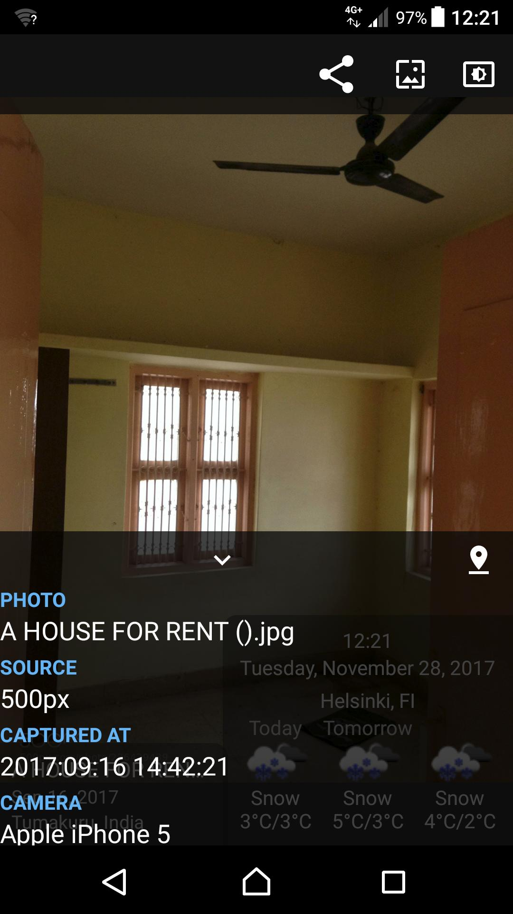
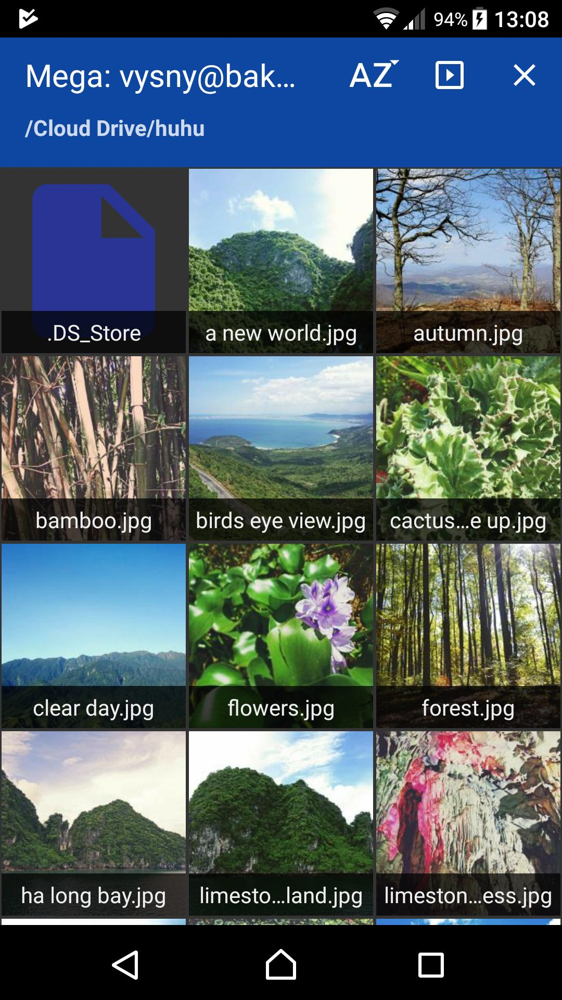

# PhotoCloud: Android Photo Frame

Just sit back and watch your photos with your family; convert your old Android tablet to a digital photo frame; browse your cloud photos, hassle-free. The only digital frame application which supports your own OwnCloud/NextCloud servers, with self-signed https certificates.

Supports common cloud services. If you don't want to publish your sensitive photos on cloud, you can set up your own OwnCloud/NextCloud/SFTP server.

Supported photo streams:
- Files stored on any OwnCloud/NextCloud server, even with self-signed https certificate
- Files stored in your Dropbox account
- Local Gallery
- Flickr
- Google Drive
- Microsoft OneDrive
- Windows Shares (Samba)
- Mega
- 500px
- Instagram (Instagram removed the Feed API thus only the Recent Media is accessible)
- SSH and SFTP
- DLNA/UPNP

Supported image types:
- bitmap: png, gif, bmp, jpg, jpeg
- raw: crw, cr2, nef, raf, dng, mos, kdc, dcr (by default ignored since loading RAWs will generate huge network traffic; just enable raws in app's Settings)

## Screenshots

Streams | Slideshow | Browser
------------ | ------------- | -----
Welcome screen with the streams | A paused slideshow, showing EXIF and the location where the photo was taken | You can browse the stream for photos and files
 |  | 

## Free Download At Google Play

Please download the PhotoCloud application for free at [Google Play](https://play.google.com/store/apps/details?id=sk.baka.photoframe).

Endlessly cycles photos from any combination of the streams. You can play all photos from the stream, or you can limit the stream to given list of directories (and subdirs). You can also browse the files of the stream manually. The photos are automatically cached locally; when offline, you can show slideshow from cached photos only.
Supports slideshowing photos from subdirectories.

Supports ChromeCast (requires Android 4.4 and higher) - casts current slideshow to your TV. Leanback/Android TV is not currently supported.

## Pricing

Pricing: free version shows a "please purchase" images once a while during the slideshow. There is an in-app payment which removes these images.
Another payment unlocks the "Daydream" functionality; this only works on Android 4.2 and higher, don't purchase if you have Android 4.1 or lower.

Please note:
This is just a digital frame / photo browser. It does not play any music, does not create videos, does not replace your gallery app, it does simply one thing - shows a slideshow of your photos - and does it simply and right.

Because of its nature, the application generates a very high network traffic - please make sure you have WIFI enabled. The app has built-in network protection and will abort the Slideshow if WIFI disconnects.

No annoying video commercials, simple to use. This application is at its infancy, please [let me know which features would you like me to implement](https://github.com/mvysny/photocloud-frame-slideshow/issues).

# Privacy Policy

PhotoCloud Frame Slideshow remembers your username/password only for certain services which do not support security tokens (for example Samba and OwnCloud). PhotoCloud never sends your data anywhere else but the stream server itself, solely for the purpose of authenticating and downloading images. Images are downloaded to your phone only, they are never uploaded anywhere. The images are cached for quicker display, you can delete the caches at any time.

PhotoCloud uploads warning and error messages anonymously to Crashlytic, for the sole purpose of helping bug fixing. Those error messages never contain any username nor password. Other than that, PhotoCloud uploads nothing nowhere else, except for the sole purpose of downloading images (you have to let the server know that you wish to download given image) :-D

# Links

* [Discussions forums](https://groups.google.com/forum/#!forum/photocloud-frame)
* [Bugs, issues, feature requests](https://github.com/mvysny/photocloud-frame-slideshow/issues)
* Contact author at: [photocloud-frame@googlegroups.com](photocloud-frame@googlegroups.com)

# FAQ

Located here: [Frequently Asked Questions](faq.html)
