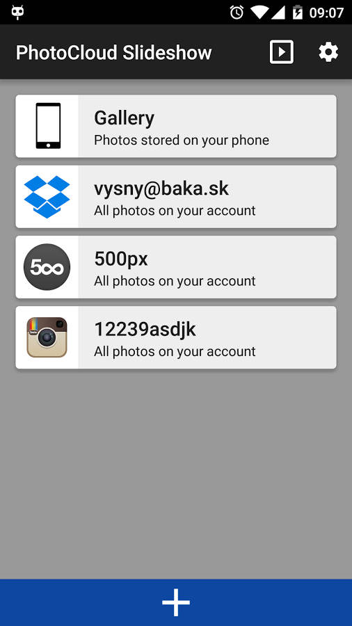

# PhotoCloud

Android Digital Frame App for Tablet, Phone and Android TV

Just sit back and watch your photos with your family; convert your old Android tablet to a digital photo frame; browse your cloud photos, hassle-free. The only digital frame application which supports your own OwnCloud/NextCloud servers, with self-signed https certificates.

Able to retrieve and slideshow photos from the following sources:
- [OwnCloud](https://owncloud.org/)/[NextCloud](https://nextcloud.com/) server, even with self-signed https certificate
- [Dropbox](https://www.dropbox.com/)
- Local Gallery
- [Flickr](https://www.flickr.com/)
- [Google Drive](https://www.google.com/drive/)
- [Microsoft OneDrive](https://onedrive.live.com/)
- Windows Shares (Samba)
- [Mega](https://mega.nz/)
- [Instagram](https://www.instagram.com/) (only the Recent Media is accessible - the Feed API is not accessible)
- SSH and SFTP
- DLNA/UPNP
- [Box: https://www.box.com/](https://www.box.com/) (only works on Android 5.0 and higher because of [TLS 1.0 deprecation](https://developer.box.com/docs/tls-1))

Respects user's privacy: PhotoCloud is the only Android Digital Frame application which supports your own personal OwnCloud/NextCloud servers (including self-signed https certificates), your own SSH+SFTP servers, photos located on your Windows machines, etc.

Supported image types:
- bitmap: png, gif, bmp, jpg, jpeg, webp, heif (Android P only)
- raw: crw, cr2, nef, raf, dng, mos, kdc, dcr (by default ignored since loading RAWs will generate huge network traffic; just enable raws in app's Settings)

## Screenshots

Streams | Slideshow | Browser
------------ | ------------- | -----
Welcome screen with the streams | A paused slideshow, showing EXIF and the location where the photo was taken | You can browse the stream for photos and files
 |  | 

A short 3 minute introduction video:

## Free Download At Google Play

Please [download the PhotoCloud application at Google Play](https://play.google.com/store/apps/details?id=sk.baka.photoframe) for free.

Endlessly cycles photos from any combination of the streams. You can play all photos from the stream, or you can limit the stream to given list of directories (and subdirs). You can also browse the files of the stream manually. The photos are automatically cached locally; when offline, you can show slideshow from cached photos only.
Supports slideshowing photos from subdirectories.

Supports:

- ChromeCast (requires Android 4.4 and higher) - casts current slideshow to your TV from your phone
- Android TV - you can run this app straight on the TV and control it via the TV remote control

Also supports Daydream (Android 4.2 and higher only).

## Pricing

Pricing: free version shows a "please purchase" images once a while during the slideshow. There is an in-app payment which removes these images.
Another payment unlocks the "Daydream" functionality; this only works on Android 4.2 and higher, don't purchase if you have Android 4.1 or lower.

Please note:
This is just a digital frame / photo browser. It does not play any music, does not create videos, does not replace your gallery app, it does simply one thing - shows a slideshow of your photos - and does it simply and right.

Because of its nature, the application generates a very high network traffic - please make sure you have WIFI enabled. The app has built-in network protection and will abort the Slideshow if WIFI disconnects.

No annoying video commercials, simple to use. This application is at its infancy, please let me know which features would you like me to implement, at the [bug tracker page](https://github.com/mvysny/photocloud-frame-slideshow/issues).

# Privacy Policy

PhotoCloud Frame Slideshow remembers your username/password only for certain services which do not support security tokens (for example Samba and OwnCloud). PhotoCloud never sends your data anywhere else but the stream server itself, solely for the purpose of authenticating and downloading images. Images are downloaded to your phone only, they are never uploaded anywhere. The images are cached for quicker display, you can delete the caches at any time.

PhotoCloud uploads warning and error messages anonymously to Crashlytic, for the sole purpose of helping bug fixing. Those error messages never contain any username nor password. Other than that, PhotoCloud uploads nothing nowhere else, except for the sole purpose of downloading images (you have to let the server know that you wish to download given image) :-D

## Required permissions

- `INTERNET` - to download photos from cloud services
- `WRITE_EXTERNAL_STORAGE` - to workaround a bug in older Androids to cache photos
- `GET_ACCOUNTS` - Google Drive and App Billing requires this
- `BILLING` - In-app purchases
- `ACCESS_NETWORK_STATE` - allows PhotoCloud to monitor for WiFi and stop slideshow to avoid cellular network charges
- `RECEIVE_BOOT_COMPLETED` - to automatically start (if so configured)
- `ACCESS_WIFI_STATE` - to discover DLNA devices
- `CHANGE_WIFI_MULTICAST_STATE` - to discover DLNA devices
- `WAKE_LOCK` - to keep the phone awake during slideshow

# Links

* [Discussions forums](https://groups.google.com/forum/#!forum/photocloud-frame)
* [Bugs, issues, feature requests](https://github.com/mvysny/photocloud-frame-slideshow/issues)

# FAQ

Located here: [Frequently Asked Questions](faq.html)

